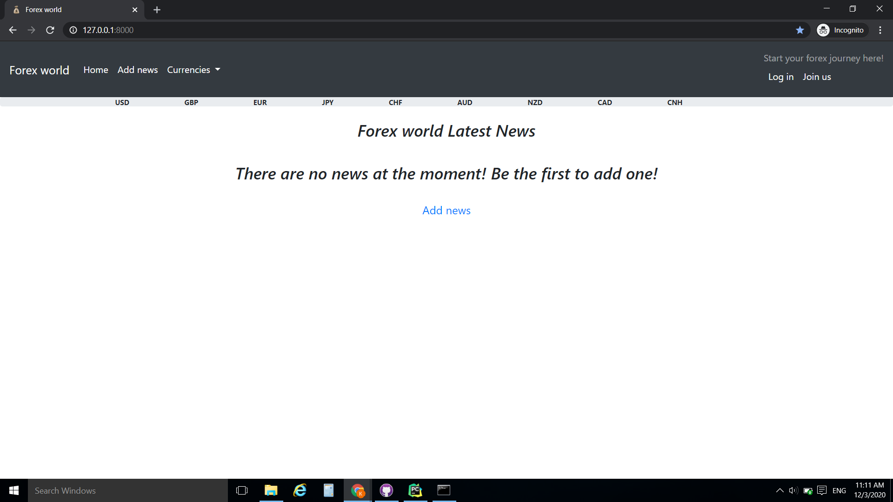

# ForexProject
Forex Project is an app that helps people to learn **forex trading**.Users can also write,read and comment articles/news and see live currency quotes.

## Table of Contents
* [About the Project](#about-the-project)
* [Technologies](#technologies)
* [Getting started](#getting-started)
* [Usage](#usage)

### About the project

 1. **What is Forex** -> The foreign exchange (also known as FX or forex) market is a global marketplace for exchanging national currencies against one another.Because of the worldwide reach of trade, commerce, and finance, forex markets tend to be the largest and most liquid asset markets in the world.
 1. **Project functionalities:**
    * Participants: 
        * Admin(has full CRUD for all products/content, created by users on the website)
        * Authenticated users(have full CRUD for all of their created content)
        * Unauthenticated users(have only get permissions)
        
    * Public part -> A part of the website, which is accessible by everyone – un/authenticated users
and admins
    * Private part -> Accessible only by authenticated user and admins
    * Admin part -> Accessible only by admins
    * login/register functionality(and forms as well)
    * Form validation
    * Testing (unit testing)
    * Class-based views
    * Extended Django user(Profile,using signals)
    * Decorators and Mixins(checking for user permissions)
    * Bootstrap
    * Crispy forms
    * Requests
    
### Technologies
* [Python 3.8](https://www.python.org/downloads/release/python-380/)
* [Django 3.1](https://www.djangoproject.com/)
* [Bootstrap 4](https://getbootstrap.com/)
### Getting Started
1. Clone the repository to your local machine:\
`git clone https://github.com/KameliyaN/ForexProject.git`

1. Install the requirements:\
`pip install -r requirements.txt`

1. Apply the migrations:\
`python manage.py migrate`
 
1. Run the development server:\
 `python manage.py runserver`

1. The project will be available at:\
 `127.0.0.1:8000`

### Usage

* View all latest forex news 
* View full news(article) with its comments
* View all news(articles) of a given user
* Add/Create news(articles)
* Edit and delete your news(articles)
* Comment news(articles)
* Edit and delete your comments
* View live currency quotes
* View  all currencies list
* View details for a currency 
* View Useful links organized by categories
